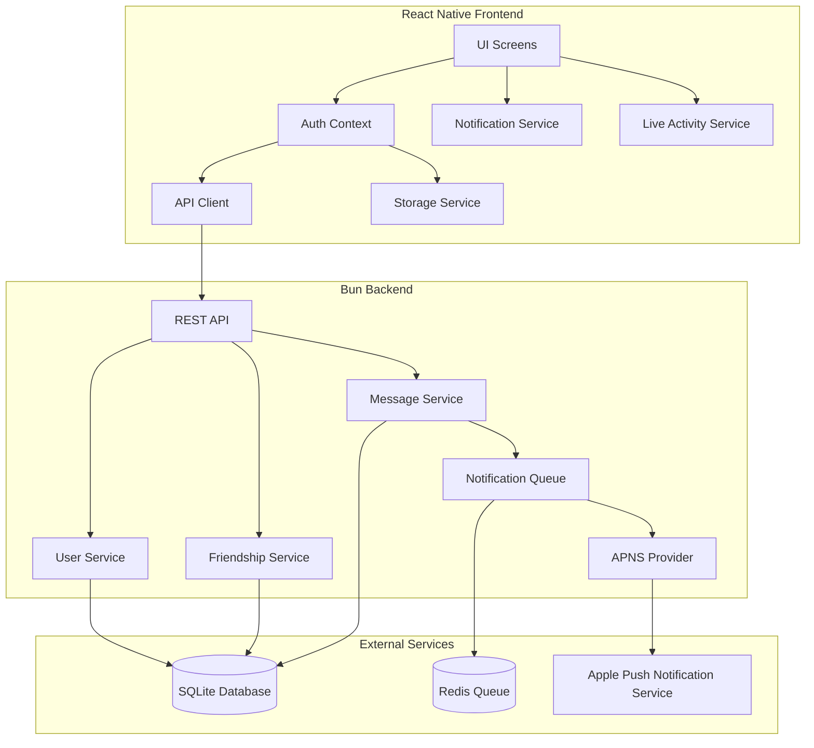

# Design Document: Frontend-Backend Integration

## Overview

This design document outlines the architecture and implementation details for fully integrating the Pager2077 frontend (React Native/Expo) with the backend (Bun/SQLite). The integration will replace all mock/dummy data with real API calls, implement proper authentication flow, add messaging functionality, and enable Live Activity push notifications for remote message delivery.

## Architecture

The system follows a client-server architecture with the following key components:



## Components and Interfaces

### Frontend Components

#### 1. AuthContext (Enhanced)

Manages authentication state and auto-registration flow.

```typescript
interface AuthContextType {
  isLoading: boolean;
  isAuthenticated: boolean;
  userId: string | null;
  hexCode: string | null;
  authToken: string | null;
  displayName: string | null;
  register: () => Promise<void>;
  logout: () => Promise<void>;
  updateDisplayName: (name: string) => Promise<void>;
}
```

#### 2. API Client (Enhanced)

Handles all backend communication with proper error handling.

```typescript
// New endpoints to add
async function getFriends(token: string): Promise<Friend[]>;
async function sendFriendRequest(token: string, hexCode: string): Promise<FriendRequest>;
async function getPendingRequests(token: string): Promise<FriendRequest[]>;
async function acceptFriendRequest(token: string, requestId: string): Promise<Friend>;
async function rejectFriendRequest(token: string, requestId: string): Promise<void>;
async function getConversations(token: string): Promise<Conversation[]>;
async function updateDisplayName(token: string, displayName: string): Promise<User>;
async function updateLiveActivityToken(token: string, laToken: string): Promise<void>;
```

#### 3. Live Activity Service (Enhanced)

Manages Live Activity tokens and remote start capability.

```typescript
interface LiveActivityService {
  areActivitiesEnabled(): Promise<boolean>;
  getPushToken(): Promise<string | null>;
  registerPushToken(token: string): Promise<void>;
  startActivity(content: LiveActivityContent): Promise<LiveActivityResult>;
  endActivity(activityId: string): Promise<void>;
}
```

### Backend Components

#### 1. Message Service (New)

Handles message creation and retrieval.

```typescript
interface MessageService {
  createMessage(senderId: string, recipientId: string, text: string): Message;
  getMessageHistory(userId: string, friendId: string, limit?: number): Message[];
  getConversationsWithUnread(userId: string): Conversation[];
  markAsRead(userId: string, friendId: string): void;
}
```

#### 2. Message Repository (New)

Database operations for messages.

```typescript
interface MessageRepository {
  create(senderId: string, recipientId: string, text: string): Message;
  getByConversation(userId1: string, userId2: string, limit: number): Message[];
  getUnreadCount(userId: string, friendId: string): number;
  markRead(userId: string, friendId: string): void;
}
```

#### 3. User Service (Enhanced)

Add display name and Live Activity token management.

```typescript
interface UserService {
  // Existing methods...
  updateDisplayName(userId: string, displayName: string): User;
  updateLiveActivityToken(userId: string, token: string | null): void;
  getLiveActivityToken(userId: string): string | null;
}
```

## Data Models

### Database Schema Updates

```sql
-- Add display_name and live_activity_token to users table
ALTER TABLE users ADD COLUMN display_name TEXT;
ALTER TABLE users ADD COLUMN live_activity_token TEXT;

-- Messages Table (New)
CREATE TABLE IF NOT EXISTS messages (
  id TEXT PRIMARY KEY,
  sender_id TEXT NOT NULL,
  recipient_id TEXT NOT NULL,
  text TEXT NOT NULL,
  is_read INTEGER DEFAULT 0,
  created_at TEXT DEFAULT CURRENT_TIMESTAMP,
  FOREIGN KEY (sender_id) REFERENCES users(id) ON DELETE CASCADE,
  FOREIGN KEY (recipient_id) REFERENCES users(id) ON DELETE CASCADE
);

CREATE INDEX IF NOT EXISTS idx_messages_conversation ON messages(sender_id, recipient_id, created_at);
CREATE INDEX IF NOT EXISTS idx_messages_recipient_unread ON messages(recipient_id, is_read);
```

### TypeScript Interfaces

```typescript
// Frontend types
interface Message {
  id: string;
  senderId: string;
  recipientId: string;
  text: string;
  timestamp: string;
  isRead: boolean;
}

interface Conversation {
  friendId: string;
  friendHexCode: string;
  friendDisplayName: string | null;
  lastMessage: Message | null;
  unreadCount: number;
}

interface Friend {
  id: string;
  hexCode: string;
  displayName: string | null;
  status: 'online' | 'offline';
}

// Backend types
interface User {
  id: string;
  hexCode: string;
  deviceToken: string;
  displayName: string | null;
  liveActivityToken: string | null;
  status: 'online' | 'offline';
  lastSeen: Date;
  createdAt: Date;
  updatedAt: Date;
}
```

## Correctness Properties

*A property is a characteristic or behavior that should hold true across all valid executions of a system-essentially, a formal statement about what the system should do. Properties serve as the bridge between human-readable specifications and machine-verifiable correctness guarantees.*

Based on the prework analysis, the following properties have been identified. Redundant properties have been consolidated.

### Property 1: Credential Storage Round Trip

*For any* valid user credentials (userId, hexCode, authToken, deviceToken), saving them to secure storage and then retrieving them SHALL return the same values.

**Validates: Requirements 1.4, 2.1, 2.2**

### Property 2: Friend Request API Format

*For any* valid 6-digit hex code, sending a friend request SHALL produce a correctly formatted API request with the hex code in the request body.

**Validates: Requirements 4.1**

### Property 3: Friend Request State Transitions

*For any* pending friend request, accepting it SHALL add the requester to the friends list AND remove the request from pending requests. Similarly, rejecting SHALL only remove from pending.

**Validates: Requirements 5.3, 5.4, 5.5, 5.6**

### Property 4: Message Creation and Retrieval

*For any* valid message sent between friends, creating the message and then fetching message history SHALL include that message with correct sender, recipient, and text.

**Validates: Requirements 6.1, 15.1, 15.2**

### Property 5: Live Activity Priority Over Push Notifications

*For any* message sent to a recipient, if the recipient has a Live Activity token, the backend SHALL send a push-to-start notification AND SHALL NOT send a regular push notification. If no Live Activity token exists, a regular push notification SHALL be sent.

**Validates: Requirements 8.1, 8.5, 9.4, 15.3, 15.4**

### Property 6: Live Activity Token Storage Round Trip

*For any* valid Live Activity push token, storing it via the API and then retrieving it SHALL return the same token value.

**Validates: Requirements 9.3, 16.1, 16.2**

### Property 7: Display Name Storage Round Trip

*For any* valid display name (1-20 chars, alphanumeric with spaces/hyphens/underscores), saving it to the backend and then fetching user data SHALL return the same display name.

**Validates: Requirements 11.1, 11.2, 12.1, 12.2, 17.1, 17.2**

### Property 8: Display Name in API Responses

*For any* API response containing user data (friends list, friend requests, messages), if the user has a display name set, it SHALL be included in the response.

**Validates: Requirements 13.1, 13.2, 13.3**

### Property 9: Display Name Fallback

*For any* user display, if the user has a display name it SHALL be shown, otherwise the hex code SHALL be shown.

**Validates: Requirements 13.4**

### Property 10: Display Name Validation

*For any* display name that is empty, longer than 20 characters, or contains invalid characters, the backend SHALL return a validation error.

**Validates: Requirements 17.3**

### Property 11: Status Change Notifications

*For any* user status change (online/offline), the backend SHALL send silent notifications to all friends of that user.

**Validates: Requirements 14.3**

### Property 12: Live Activity Token Invalidation Fallback

*For any* message where the Live Activity token is invalid or expired, the backend SHALL remove the token and fall back to regular push notifications.

**Validates: Requirements 9.7, 16.3**

## Error Handling

### Frontend Error Handling

| Error Type | User Message | Action |
|------------|--------------|--------|
| Network Error | "NETWORK ERROR" | Allow retry |
| Timeout | "TIMEOUT" | Allow retry |
| User Not Found | "USER NOT FOUND" | Clear input |
| Already Friends | "ALREADY FRIENDS" | Return to friends |
| Request Exists | "REQUEST ALREADY SENT" | Return to friends |
| Invalid Token | "SESSION EXPIRED" | Re-register |
| Invalid Display Name | "INVALID NAME" | Show validation error |

### Backend Error Codes

```typescript
const ErrorCodes = {
  // User errors (400)
  USER_NOT_FOUND: 'USER_NOT_FOUND',
  INVALID_HEX_CODE: 'INVALID_HEX_CODE',
  INVALID_INPUT: 'INVALID_INPUT',
  INVALID_DISPLAY_NAME: 'INVALID_DISPLAY_NAME',
  MESSAGE_TOO_LONG: 'MESSAGE_TOO_LONG',
  
  // Conflict errors (409)
  DUPLICATE_REQUEST: 'DUPLICATE_REQUEST',
  FRIENDSHIP_EXISTS: 'FRIENDSHIP_EXISTS',
  
  // Auth errors (401, 403)
  UNAUTHORIZED: 'UNAUTHORIZED',
  FORBIDDEN: 'FORBIDDEN',
  INVALID_TOKEN: 'INVALID_TOKEN',
  NOT_FRIENDS: 'NOT_FRIENDS',
  
  // Server errors (500)
  DATABASE_ERROR: 'DATABASE_ERROR',
  NOTIFICATION_FAILED: 'NOTIFICATION_FAILED',
};
```

## Testing Strategy

### Dual Testing Approach

This implementation uses both unit tests and property-based tests:

- **Unit tests**: Verify specific examples, edge cases, and error conditions
- **Property-based tests**: Verify universal properties that should hold across all inputs

### Property-Based Testing Framework

The project will use **fast-check** for TypeScript property-based testing.

```bash
npm install --save-dev fast-check
```

### Test Configuration

- Each property-based test SHALL run a minimum of 100 iterations
- Each property-based test SHALL be tagged with a comment referencing the correctness property it implements
- Format: `**Feature: frontend-backend-integration, Property {number}: {property_text}**`

### Unit Test Coverage

| Component | Test Focus |
|-----------|------------|
| API Client | Request formatting, error handling, timeout behavior |
| Storage Service | Credential persistence, retrieval, clearing |
| Auth Context | State transitions, registration flow |
| Message Service | Message creation, history retrieval |
| User Service | Display name validation, token management |
| Notification Service | Priority logic, fallback behavior |

### Property-Based Test Coverage

| Property | Test Description |
|----------|------------------|
| Property 1 | Generate random credentials, save/retrieve, verify equality |
| Property 2 | Generate random 6-digit codes, verify API request format |
| Property 3 | Generate friend requests, accept/reject, verify state changes |
| Property 4 | Generate random messages, create/retrieve, verify content |
| Property 5 | Generate messages with/without LA tokens, verify notification type |
| Property 6 | Generate random LA tokens, save/retrieve, verify equality |
| Property 7 | Generate valid display names, save/retrieve, verify equality |
| Property 8 | Generate users with display names, fetch via API, verify inclusion |
| Property 9 | Generate users with/without names, verify display logic |
| Property 10 | Generate invalid display names, verify validation errors |
| Property 11 | Generate status changes, verify notification broadcast |
| Property 12 | Generate invalid LA tokens, verify fallback behavior |

### Integration Tests

- End-to-end registration flow
- Friend request lifecycle (send → accept/reject)
- Message send and receive flow
- Live Activity token registration and usage
- Display name update flow
