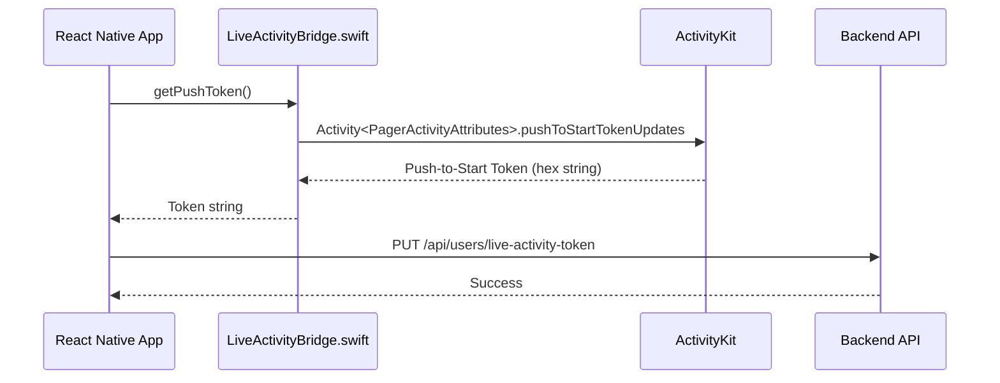
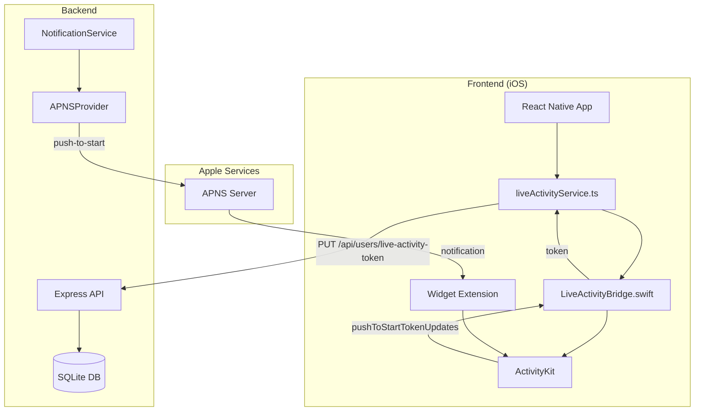

# Live Activity Token Flow Analysis - Design Document

## Overview

This design document analyzes the Live Activity token flow in Pager2077 to identify and fix a potential logic error. The key distinction is between two different token types:

| Token Type | Purpose | iOS Version | APNS Topic |
|------------|---------|-------------|------------|
| Device Token | Regular push notifications (alerts, badges) | iOS 10+ | `com.pager2077.app` |
| Push-to-Start Token | Remotely start Live Activities | iOS 17.2+ | `com.pager2077.app.push-type.liveactivity` |

## Current Implementation Analysis

### Frontend Token Flow



**Current Implementation (LiveActivityBridge.swift:227-262):**
```swift
@objc
func getPushToken(_ resolve: @escaping RCTPromiseResolveBlock,
                  reject: @escaping RCTPromiseRejectBlock) {
    
    guard #available(iOS 17.2, *) else {
        resolve(nil)
        return
    }
    
    guard ActivityAuthorizationInfo().areActivitiesEnabled else {
        resolve(nil)
        return
    }
    
    Task {
        for await data in Activity<PagerActivityAttributes>.pushToStartTokenUpdates {
            let tokenString = data.map { String(format: "%02x", $0) }.joined()
            resolve(tokenString)
            return
        }
        resolve(nil)
    }
}
```

**✅ CORRECT**: The frontend correctly uses `Activity<PagerActivityAttributes>.pushToStartTokenUpdates` to obtain the push-to-start token, NOT the device token.

### Frontend Token Registration (liveActivityService.ts:272-295)

```typescript
export async function registerPushTokenWithBackend(authToken: string): Promise<boolean> {
  try {
    const pushToken = await getPushToken();
    
    if (!pushToken) {
      console.log('[LiveActivity] No push token to register');
      return false;
    }
    
    const { updateLiveActivityToken } = await import('./apiClient');
    await updateLiveActivityToken(authToken, pushToken);
    return true;
  } catch (error) {
    console.error('[LiveActivity] Failed to register push token with backend:', error);
    return false;
  }
}
```

**✅ CORRECT**: The frontend sends the push-to-start token to the correct endpoint.

### Backend Token Storage (UserRepository.ts:131-140)

```typescript
updateLiveActivityToken(userId: string, liveActivityToken: string | null): void {
  const now = new Date().toISOString();
  const stmt = this.db.prepare(`
    UPDATE users 
    SET live_activity_token = ?, updated_at = ?
    WHERE id = ?
  `);
  stmt.run(liveActivityToken, now, userId);
}
```

**✅ CORRECT**: The backend stores the token in a separate `live_activity_token` field, distinct from `device_token`.

### Backend Notification Sending (NotificationService.ts:189-230)

```typescript
async notifyMessageReceivedViaLiveActivity(
  recipient: User,
  senderName: string,
  messageText: string,
  messageId: string
): Promise<void> {
  // ...
  await queueNotification({
    type: 'liveactivity',
    userId: recipient.id,
    notification: {
      deviceToken: recipient.deviceToken,  // Fallback data
    },
    liveActivityNotification: {
      pushToken: recipient.liveActivityToken!,  // ✅ Uses liveActivityToken
      contentState: {
        sender: senderName,
        message: truncatedMessage,
        timestamp: new Date().toISOString(),
        isDemo: false,
        messageIndex: 1,
        totalMessages: 1,
      },
      // ...
    },
  });
}
```

**✅ CORRECT**: The backend uses `recipient.liveActivityToken` for the Live Activity notification.

### APNS Provider (APNSProvider.ts:280-330)

```typescript
async sendLiveActivityNotification(notification: LiveActivityNotification): Promise<void> {
  const payload = JSON.stringify({
    aps: {
      timestamp: issueTime,
      event: 'start',
      'content-state': notification.contentState,
      alert: notification.alert,
      sound: 'default',
    },
    'attributes-type': 'PagerActivityAttributes',
    attributes: {
      activityType: 'message',
    },
  });

  const result = await this.sendRequest(
    client,
    notification.pushToken,
    payload,
    `${this.bundleId}.push-type.liveactivity`,  // ✅ Correct topic
    'liveactivity',  // ✅ Correct push type
    10
  );
}
```

**✅ CORRECT**: The APNS provider uses:
- Correct topic: `com.pager2077.app.push-type.liveactivity`
- Correct push type: `liveactivity`
- Correct payload format with `event: 'start'`, `content-state`, `attributes-type`, and `attributes`

## Identified Issues

### Issue 1: Content State Field Naming Mismatch

**Problem**: The backend sends `timestamp` as an ISO string, but the Swift `ContentState` expects a `Date` type.

**Backend (APNSProvider.ts):**
```typescript
'content-state': {
  sender: string,
  message: string,
  timestamp: string,  // ISO string like "2024-01-15T10:30:00.000Z"
  isDemo: boolean,
  messageIndex: number,
  totalMessages: number,
}
```

**Swift Widget (liveactivityLiveActivity.swift):**
```swift
struct ContentState: Codable, Hashable {
    var sender: String
    var message: String
    var timestamp: Date  // Expects Date, not String
    var isDemo: Bool
    var messageIndex: Int
    var totalMessages: Int
}
```

**Impact**: The `Codable` protocol should handle ISO 8601 date strings automatically, but this depends on the decoder configuration. This could cause parsing failures.

### Issue 2: Potential Token Timeout

**Problem**: The `getPushToken` function in `LiveActivityBridge.swift` has a 5-second timeout, but the `pushToStartTokenUpdates` async sequence may not emit immediately.

```swift
Task {
    try? await Task.sleep(nanoseconds: 5_000_000_000) // 5 seconds
    if !hasResolved {
        resolveOnce(nil)
    }
}
```

**Impact**: On first launch or after app reinstall, the token may not be available immediately, causing registration to fail silently.

### Issue 3: Missing Retry Logic for Token Registration

**Problem**: In `App.tsx`, the token registration has a single retry after 2 seconds, but if the token is not available on first launch, subsequent app launches may not retry.

```typescript
const success = await registerPushTokenWithBackend(authToken);
if (!success) {
  await new Promise(resolve => setTimeout(resolve, 2000));
  const retrySuccess = await registerPushTokenWithBackend(authToken);
}
```

**Impact**: Users who launch the app before the push-to-start token is available may never get Live Activity notifications.

## Architecture



## Components and Interfaces

### Token Types

| Component | Token Field | Purpose |
|-----------|-------------|---------|
| User model | `deviceToken` | Regular APNS notifications |
| User model | `liveActivityToken` | Live Activity push-to-start |

### API Endpoints

| Endpoint | Method | Purpose |
|----------|--------|---------|
| `/api/users/register` | POST | Register device token |
| `/api/users/live-activity-token` | PUT | Update Live Activity token |

### APNS Configuration

| Notification Type | Topic | Push Type | Priority |
|-------------------|-------|-----------|----------|
| Alert | `com.pager2077.app` | `alert` | 10 |
| Silent | `com.pager2077.app` | `background` | 5 |
| Live Activity | `com.pager2077.app.push-type.liveactivity` | `liveactivity` | 10 |

## Data Models

### Push-to-Start Payload Format

```json
{
  "aps": {
    "timestamp": 1705312200,
    "event": "start",
    "content-state": {
      "sender": "FRIEND123",
      "message": "Hello from the pager!",
      "timestamp": "2024-01-15T10:30:00.000Z",
      "isDemo": false,
      "messageIndex": 1,
      "totalMessages": 1
    },
    "alert": {
      "title": "FRIEND123",
      "body": "Hello from the pager!"
    },
    "sound": "default"
  },
  "attributes-type": "PagerActivityAttributes",
  "attributes": {
    "activityType": "message"
  }
}
```

### ContentState Mapping

| Backend Field | Swift Field | Type | Notes |
|---------------|-------------|------|-------|
| sender | sender | String | Max 20 chars |
| message | message | String | Truncated to 100 chars |
| timestamp | timestamp | Date | ISO 8601 string → Date |
| isDemo | isDemo | Bool | Default false |
| messageIndex | messageIndex | Int | Default 1 |
| totalMessages | totalMessages | Int | Default 1 |

## Correctness Properties

*A property is a characteristic or behavior that should hold true across all valid executions of a system-essentially, a formal statement about what the system should do. Properties serve as the bridge between human-readable specifications and machine-verifiable correctness guarantees.*

### Property 1: Token validation before registration

*For any* token registration attempt, the system SHALL only send a token to the backend if the token is non-null and Live Activities are enabled on the device.

**Validates: Requirements 2.3, 2.4**

### Property 2: Correct token usage for Live Activity notifications

*For any* Live Activity notification, the system SHALL use the `liveActivityToken` field (not `deviceToken`) when constructing the APNS request.

**Validates: Requirements 3.2**

### Property 3: Correct APNS configuration for Live Activity

*For any* Live Activity notification, the system SHALL use topic `{bundleId}.push-type.liveactivity` and push-type `liveactivity`.

**Validates: Requirements 3.3, 3.4**

### Property 4: Valid push-to-start payload format

*For any* Live Activity push-to-start notification, the payload SHALL contain: `event: "start"`, `content-state` with all required fields, `attributes-type: "PagerActivityAttributes"`, `attributes` object, and `timestamp` in the `aps` dictionary.

**Validates: Requirements 4.1, 4.2, 4.3, 4.4, 4.5**

## Error Handling

### Token Registration Errors

| Error | Cause | Handling |
|-------|-------|----------|
| Token null | iOS < 17.2 or LA disabled | Skip registration, use regular push |
| Timeout | Token not available yet | Retry after delay |
| Network error | Backend unreachable | Log error, retry on next launch |

### Notification Sending Errors

| Error | Cause | Handling |
|-------|-------|----------|
| BadDeviceToken | Invalid LA token | Clear token, fall back to regular push |
| Unregistered | Token expired | Clear token, fall back to regular push |
| InvalidToken | Malformed token | Clear token, fall back to regular push |

## Testing Strategy

### Property-Based Testing

**Library**: `fast-check` (JavaScript property-based testing library)

**Configuration**: Each property test runs a minimum of 100 iterations.

**Test Annotation Format**: `**Feature: live-activity-token-flow, Property {number}: {property_text}**`

### Unit Tests

- Token validation logic
- APNS payload construction
- Token storage and retrieval
- Fallback to regular push notifications

### Integration Tests

- End-to-end token registration flow
- Live Activity notification delivery (requires physical device)

## Recommendations

### Fix 1: Add Date Decoding Strategy

Ensure the Swift `ContentState` can decode ISO 8601 date strings. The `Codable` protocol should handle this automatically, but verify the decoder configuration.

### Fix 2: Improve Token Registration Retry

Add persistent retry logic that attempts token registration on each app launch until successful:

```typescript
// Store registration status in AsyncStorage
const isRegistered = await AsyncStorage.getItem('la_token_registered');
if (!isRegistered) {
  const success = await registerPushTokenWithBackend(authToken);
  if (success) {
    await AsyncStorage.setItem('la_token_registered', 'true');
  }
}
```

### Fix 3: Add Token Refresh on App Foreground

Re-register the token when the app comes to foreground, as tokens can change:

```typescript
AppState.addEventListener('change', async (state) => {
  if (state === 'active') {
    await registerPushTokenWithBackend(authToken);
  }
});
```

### Fix 4: Add Logging for Debugging

Add detailed logging to track token flow:

```typescript
console.log('[LA Token] Obtained:', token?.substring(0, 20) + '...');
console.log('[LA Token] Sent to backend');
console.log('[LA Token] Backend confirmed storage');
```

