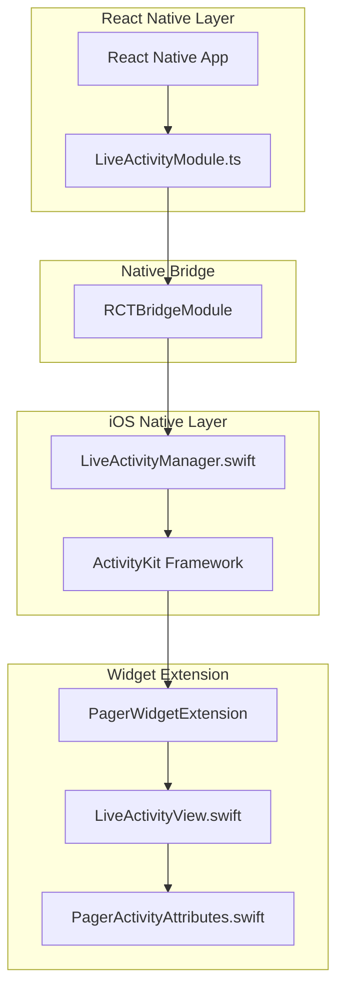

# Live Activity Feature Design

## Overview

This design document outlines the implementation of iOS Live Activity support for the Pager2077 React Native application. Live Activities allow the app to display real-time message notifications on the iOS lock screen and Dynamic Island, providing users with a glanceable, retro-pager experience.

The implementation requires:
1. A native iOS Widget Extension with SwiftUI views
2. A React Native native module to bridge JavaScript and ActivityKit
3. Integration with the existing notification system

## Architecture



### Data Flow

1. **Start Activity**: React Native calls `startActivity(sender, message)` → Native module creates ActivityKit activity → Widget Extension renders UI
2. **Update Activity**: React Native calls `updateActivity(activityId, newContent)` → Native module updates ActivityKit state → Widget Extension re-renders
3. **End Activity**: React Native calls `endActivity(activityId)` → Native module ends ActivityKit activity → Widget Extension dismissed

## Components and Interfaces

### 1. React Native Module (`LiveActivityModule.ts`)

```typescript
interface LiveActivityContent {
  sender: string;
  message: string;
  timestamp: number;
}

interface LiveActivityResult {
  success: boolean;
  activityId?: string;
  error?: string;
}

interface LiveActivityModule {
  startActivity(content: LiveActivityContent): Promise<LiveActivityResult>;
  updateActivity(activityId: string, content: LiveActivityContent): Promise<LiveActivityResult>;
  endActivity(activityId: string): Promise<LiveActivityResult>;
  areActivitiesEnabled(): Promise<boolean>;
}
```

### 2. Native Bridge (`LiveActivityBridge.swift`)

The native module exposes methods to React Native:

```swift
@objc(LiveActivityBridge)
class LiveActivityBridge: NSObject {
  @objc func startActivity(_ content: NSDictionary, 
                           resolver: @escaping RCTPromiseResolveBlock,
                           rejecter: @escaping RCTPromiseRejectBlock)
  
  @objc func updateActivity(_ activityId: String,
                            content: NSDictionary,
                            resolver: @escaping RCTPromiseResolveBlock,
                            rejecter: @escaping RCTPromiseRejectBlock)
  
  @objc func endActivity(_ activityId: String,
                         resolver: @escaping RCTPromiseResolveBlock,
                         rejecter: @escaping RCTPromiseRejectBlock)
  
  @objc func areActivitiesEnabled(_ resolver: @escaping RCTPromiseResolveBlock,
                                   rejecter: @escaping RCTPromiseRejectBlock)
}
```

### 3. Activity Attributes (`PagerActivityAttributes.swift`)

Shared between main app and Widget Extension:

```swift
import ActivityKit

struct PagerActivityAttributes: ActivityAttributes {
  public struct ContentState: Codable, Hashable {
    var sender: String
    var message: String
    var timestamp: Date
  }
  
  // Static attributes (don't change during activity)
  var activityType: String = "message"
}
```

### 4. Widget Extension Views

**Lock Screen View** - Full-width banner with retro pager aesthetic:
- Dark background with LCD-style green text
- Sender identifier in header
- Message preview in body
- Timestamp in footer

**Dynamic Island Compact** - Minimal view showing sender icon/identifier

**Dynamic Island Expanded** - Similar to lock screen but sized for Dynamic Island

## Data Models

### LiveActivityContent

| Field | Type | Description |
|-------|------|-------------|
| sender | string | 6-digit friend identifier or display name |
| message | string | Message preview (truncated to 100 chars) |
| timestamp | number | Unix timestamp of message |

### LiveActivityResult

| Field | Type | Description |
|-------|------|-------------|
| success | boolean | Whether the operation succeeded |
| activityId | string? | Unique identifier for the activity (on success) |
| error | string? | Error message (on failure) |

### PagerActivityAttributes.ContentState

| Field | Type | Description |
|-------|------|-------------|
| sender | String | Sender identifier |
| message | String | Message content |
| timestamp | Date | Message timestamp |

## Correctness Properties

*A property is a characteristic or behavior that should hold true across all valid executions of a system-essentially, a formal statement about what the system should do. Properties serve as the bridge between human-readable specifications and machine-verifiable correctness guarantees.*

Based on the prework analysis, the following testable properties have been identified:

### Property 1: Start activity returns valid result

*For any* valid sender string (non-empty, max 20 chars) and message string (non-empty, max 500 chars), calling `startActivity` SHALL return a result with `success: true` and a non-empty `activityId` string, OR `success: false` with a non-empty `error` string.

**Validates: Requirements 3.1, 3.4**

### Property 2: Update activity succeeds for active activities

*For any* activity that was successfully started (has valid activityId), calling `updateActivity` with new valid content SHALL return a result with `success: true`, OR `success: false` with a non-empty `error` string if the activity is no longer active.

**Validates: Requirements 3.2, 3.4**

### Property 3: End activity deactivates the activity

*For any* activity that was successfully started, calling `endActivity` SHALL return `success: true`, and subsequent calls to `updateActivity` with that activityId SHALL return `success: false`.

**Validates: Requirements 3.3, 3.4**

## Error Handling

### Error Scenarios

| Error | Cause | Response |
|-------|-------|----------|
| `ACTIVITIES_NOT_SUPPORTED` | iOS version < 16.1 or Live Activities disabled | Return `{ success: false, error: "Live Activities not supported" }` |
| `ACTIVITY_NOT_FOUND` | Invalid or expired activityId | Return `{ success: false, error: "Activity not found" }` |
| `INVALID_CONTENT` | Missing or invalid sender/message | Return `{ success: false, error: "Invalid content" }` |
| `SYSTEM_ERROR` | ActivityKit framework error | Return `{ success: false, error: <system message> }` |

### Error Handling Strategy

1. **Graceful Degradation**: If Live Activities are not supported, the app falls back to standard push notifications
2. **Validation**: All inputs are validated before calling ActivityKit
3. **Logging**: All errors are logged for debugging with activity state information
4. **User Feedback**: Errors are not shown to users; the system silently falls back to notifications

## Testing Strategy

### Dual Testing Approach

This feature requires both unit tests and property-based tests:

- **Unit tests**: Verify specific examples, edge cases, and error conditions
- **Property-based tests**: Verify universal properties hold across all valid inputs

### Property-Based Testing

**Library**: `fast-check` (JavaScript property-based testing library)

**Configuration**: Each property test runs a minimum of 100 iterations.

**Test Annotation Format**: `**Feature: live-activity, Property {number}: {property_text}**`

### Unit Tests

Unit tests cover:
- Native module initialization
- Error handling for unsupported devices
- Demo activity creation with expected placeholder values
- Push token registration on app launch

### Test Files

- `frontend/src/services/__tests__/liveActivityService.test.ts` - Unit tests for the React Native service
- `frontend/src/services/__tests__/liveActivityService.property.test.ts` - Property-based tests

### Mock Strategy

For testing without a physical iOS device:
- Mock the native module responses
- Test the JavaScript layer logic independently
- Use Xcode simulator for manual Widget Extension testing

## Implementation Notes

### iOS Configuration Requirements

1. **Info.plist**: Add `NSSupportsLiveActivities = YES`
2. **Entitlements**: Enable Push Notifications capability
3. **Widget Extension Target**: Create new target with `WidgetKit` and `ActivityKit` frameworks
4. **Shared App Group**: For data sharing between main app and extension

### Expo Configuration

Since this is an Expo managed project, we need to:
1. Create a config plugin to add the Widget Extension
2. Use `expo prebuild` to generate native code
3. Manually add Widget Extension in Xcode (one-time setup)

### SwiftUI View Guidelines

The Widget Extension views should follow the retro pager aesthetic:
- Background: Dark (#1a1a1a) or LCD green (#C7D3C0)
- Text: Monospace font, LCD-style appearance
- Borders: Sharp corners, thick borders where appropriate
- Colors: Monochrome palette matching the app theme
