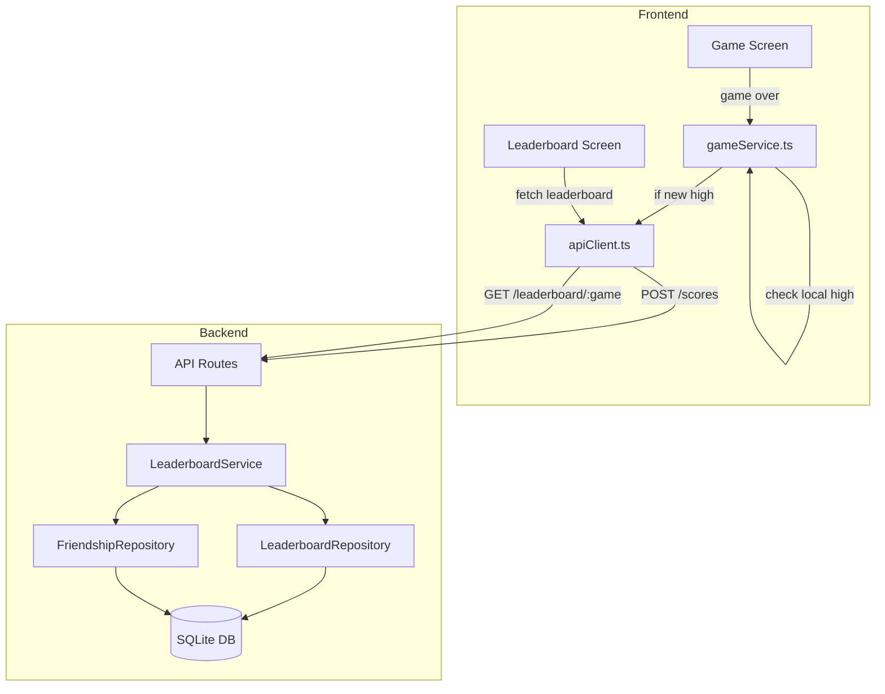

# Social Leaderboard Design Document

## Overview

The Social Leaderboard feature adds competitive gameplay to Pager2077 by allowing users to track and compare high scores with their friends. The system follows a simple, efficient design where each user has at most one score record per game, and leaderboards are dynamically filtered based on the user's friends list.

Key design principles:
- **Minimal data storage**: One row per user per game (upsert pattern)
- **Client-side optimization**: Only submit scores that beat personal bests
- **Friends-only visibility**: Leaderboards filtered via friendship join
- **Existing infrastructure reuse**: Leverages current auth, friendship, and API patterns

## Architecture



## Components and Interfaces

### Backend Components

#### LeaderboardRepository

Handles all database operations for the `high_scores` table.

```typescript
interface LeaderboardRepository {
  // Get user's high score for a game (null if none exists)
  getUserScore(userId: string, game: GameId): HighScore | null;
  
  // Upsert score - only updates if new score is higher
  upsertScore(userId: string, game: GameId, score: number): HighScore;
  
  // Get leaderboard for a list of user IDs
  getScoresForUsers(userIds: string[], game: GameId): HighScore[];
}
```

#### LeaderboardService

Business logic for score management and leaderboard retrieval.

```typescript
interface LeaderboardService {
  // Submit a score - returns updated score or current if not higher
  submitScore(userId: string, game: GameId, score: number): {
    updated: boolean;
    score: HighScore;
  };
  
  // Get friends leaderboard including user's own score
  getFriendsLeaderboard(userId: string, game: GameId): LeaderboardEntry[];
}
```

### Frontend Components

#### gameService.ts Updates

Extended to support server-side score submission.

```typescript
// New functions to add
async function submitHighScore(gameId: GameId, score: number): Promise<boolean>;
async function getFriendsLeaderboard(gameId: GameId): Promise<FriendsLeaderboardEntry[]>;
async function getMyHighScore(gameId: GameId): Promise<number | null>;
```

#### LeaderboardView.tsx Updates

Enhanced to display friends leaderboard with user highlighting.

```typescript
interface FriendsLeaderboardEntry {
  rank: number;
  userId: string;
  displayName: string | null;
  hexCode: string;
  score: number;
  updatedAt: string;
  isCurrentUser: boolean;
}
```

### API Endpoints

#### POST /api/scores

Submit a new high score.

**Request:**
```typescript
{
  game: "snake" | "tetris";
  score: number;
}
```

**Response:**
```typescript
{
  success: true;
  data: {
    updated: boolean;  // true if score was updated
    score: number;     // current high score
    updatedAt: string; // timestamp
  }
}
```

#### GET /api/leaderboard/:game

Get friends leaderboard for a game.

**Response:**
```typescript
{
  success: true;
  data: {
    entries: Array<{
      userId: string;
      displayName: string | null;
      hexCode: string;
      score: number;
      updatedAt: string;
    }>;
  }
}
```

## Data Models

### Database Schema

```sql
-- High Scores Table
CREATE TABLE IF NOT EXISTS high_scores (
  user_id TEXT NOT NULL,
  game TEXT NOT NULL CHECK(game IN ('snake', 'tetris')),
  score INTEGER NOT NULL,
  updated_at TEXT DEFAULT CURRENT_TIMESTAMP,
  PRIMARY KEY (user_id, game),
  FOREIGN KEY (user_id) REFERENCES users(id) ON DELETE CASCADE
);

CREATE INDEX IF NOT EXISTS idx_high_scores_game ON high_scores(game);
CREATE INDEX IF NOT EXISTS idx_high_scores_score ON high_scores(game, score DESC);
```

### TypeScript Models

```typescript
// Backend model
interface HighScore {
  userId: string;
  game: GameId;
  score: number;
  updatedAt: Date;
}

// API response model
interface LeaderboardEntry {
  userId: string;
  displayName: string | null;
  hexCode: string;
  score: number;
  updatedAt: string;
}

// Frontend model with rank and current user flag
interface FriendsLeaderboardEntry extends LeaderboardEntry {
  rank: number;
  isCurrentUser: boolean;
}
```

## Correctness Properties


*A property is a characteristic or behavior that should hold true across all valid executions of a system-essentially, a formal statement about what the system should do. Properties serve as the bridge between human-readable specifications and machine-verifiable correctness guarantees.*

### Property 1: Score Update Monotonicity

*For any* user and game combination, if a score submission is processed, the stored high score SHALL be the maximum of the previous high score and the submitted score. Submitting a lower or equal score SHALL NOT change the stored value.

**Validates: Requirements 1.1, 1.2**

### Property 2: Leaderboard Membership

*For any* leaderboard query, all returned entries SHALL belong to either the requesting user or a user in the requester's friends list. No entries from non-friends SHALL appear in the results.

**Validates: Requirements 2.1, 2.2**

### Property 3: Leaderboard Ordering

*For any* leaderboard query result with multiple entries, the entries SHALL be sorted by score in strictly descending order (entry[i].score >= entry[i+1].score for all valid indices).

**Validates: Requirements 2.3**

### Property 4: Leaderboard Data Completeness

*For any* leaderboard entry returned by the system, the entry SHALL contain non-null values for userId, hexCode, score, and updatedAt. The displayName field may be null but SHALL be present.

**Validates: Requirements 2.4**

### Property 5: Client Submission Logic

*For any* game completion with a final score, the client SHALL invoke the score submission API if and only if the final score is strictly greater than the locally stored high score for that game.

**Validates: Requirements 3.1, 3.2**

### Property 6: Current User Identification

*For any* leaderboard display where the current user has a score, exactly one entry SHALL have isCurrentUser set to true, and that entry's userId SHALL match the current user's ID.

**Validates: Requirements 4.3**

### Property 7: Single Record Invariant

*For any* sequence of score submissions for a given user and game, the high_scores table SHALL contain at most one record for that user/game combination at any point in time.

**Validates: Requirements 5.1**

## Error Handling

### Backend Errors

| Error Code | HTTP Status | Description |
|------------|-------------|-------------|
| `INVALID_GAME` | 400 | Game identifier not recognized |
| `INVALID_SCORE` | 400 | Score is not a positive integer |
| `UNAUTHORIZED` | 401 | Missing or invalid auth token |
| `USER_NOT_FOUND` | 404 | Authenticated user not found in database |

### Frontend Error Handling

- **Network errors**: Silently fail score submission, keep local score. Retry on next game completion if still higher.
- **API errors**: Log to console, show no user-facing error for score submission failures.
- **Leaderboard fetch errors**: Show "Unable to load leaderboard" message with retry option.

## Testing Strategy

### Property-Based Testing

The project will use **fast-check** for property-based testing in TypeScript. Each correctness property will be implemented as a property-based test with a minimum of 100 iterations.

Property tests will be annotated with the format: `**Feature: social-leaderboard, Property {number}: {property_text}**`

### Unit Tests

Unit tests will cover:
- LeaderboardRepository CRUD operations
- LeaderboardService business logic
- API endpoint request/response handling
- Client-side submission decision logic

### Test Data Generation

For property-based tests, generators will produce:
- Random user IDs (UUID format)
- Random game identifiers from valid set
- Random scores (positive integers, 0-999999)
- Random friendship graphs
- Random existing high score states
