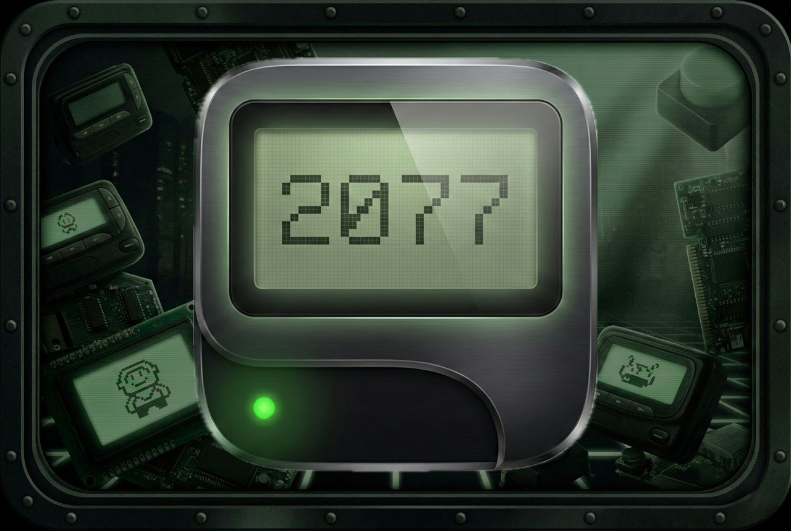

# Pager 2077

<div align="center">



**A retro messaging app with 90s pager aesthetics**

[](https://kiro.dev/)
[](https://reactnative.dev/)
[](https://www.typescriptlang.org/)
[](https://bun.sh/)
[](https://sqlite.org/)

</div>


## Inspiration

We wanted to capture the nostalgic charm of 90s pagers. Those chunky, monochrome devices felt like magic before smartphones took over. There's something beautifully simple about the constraints of that era: limited screens, T9 input, and the anticipation of waiting for a message. We asked ourselves: what if we brought that experience back, but with modern connectivity and a cyberpunk twist?

## What it does

Pager 2077 is a retro-futuristic messaging app that looks and feels like a 90s pager. Users get a unique 6-digit code as their identity, add friends using those codes, and exchange messages through an authentic LCD display interface.


<p align="center">
  
</p>

## Project Structure

```
pager2077/
├── frontend/          # React Native mobile app (Expo + TypeScript)
├── backend/           # Bun + SQLite backend
└── .kiro/specs/       # Design specifications and requirements
```

## Features

- T9-style text input with multi-tap character entry
- Classic phone numpad navigation (2/4/6/8 for directional controls)
- Unique 6-digit user codes for adding friends
- Real-time battery indicator with charging animation
- Built-in games (Snake and Tetris) with social leaderboards
- iOS Live Activities showing incoming messages on the lock screen
- Push notifications via Apple Push Notification Service
- Retro 90s pager-style UI (monochrome LCD, pixelated fonts)
- Online/offline status indicators

## How we built it

- **Frontend**: React Native with Expo, featuring custom components that replicate LCD scanlines, metallic button gradients, and the iconic green-on-black display
- **Backend**: Bun runtime with SQLite for data persistence and Redis for notification queuing
- **Native iOS**: Swift extensions for Live Activities that display messages in the Dynamic Island
- **Design System**: Every component follows strict retro guidelines — sharp corners, thick borders, monochrome palette, and pixelated typography

## Challenges we ran into

- **Live Activities integration**: Bridging React Native to native Swift for Dynamic Island support required custom Expo plugins and careful token management
- **T9 input accuracy**: Getting multi-tap text entry to feel responsive while cycling through characters took several iterations
- **Authentic LCD aesthetics**: Recreating convincing scanlines and vignette effects without killing performance was tricky. We landed on a dual-layer approach with 300 horizontal and 150 vertical lines
- **Push notification reliability**: Managing APNS tokens across app states and ensuring delivery required a robust queue system

## Accomplishments that we're proud of

- The visual authenticity — people genuinely think they're looking at a real pager
- Live Activities that make incoming messages feel urgent and retro-cool on the lock screen
- A complete social system with friend codes, requests, and real-time status
- Two fully playable games with global leaderboards, all rendered on the LCD display
- The haptic and audio feedback that makes every button press satisfying

## What we learned

- Native module bridging in React Native is powerful but requires deep understanding of both platforms
- Constraints breed creativity — limiting ourselves to monochrome and simple shapes forced better design decisions
- Spec-driven development with clear requirements prevents scope creep and keeps features focused
- Users love nostalgia, but they expect modern reliability underneath

## Tech Stack

### Frontend

- **Framework**: React Native (Expo)
- **UI Library**: NativeBase (customized for retro aesthetic)
- **Language**: TypeScript
- **State Management**: React Context

### Backend

- **Runtime**: Bun
- **Language**: TypeScript
- **Database**: SQLite

## Getting Started

### Frontend Development

**For Push Notifications (Recommended):**

```bash
cd frontend
npm install

# Build with Xcode (required for push notifications)
npx expo prebuild --platform ios
open ios/Pager2077.xcworkspace
# Configure signing and click Play

# Daily development (after first build)
npx expo start --dev-client
# Press 'i' for iOS - instant launch + hot reload!
```

**Why Xcode Build?**
- Push notifications require proper Apple entitlements
- Expo Go doesn't support custom push notifications
- Build once with Xcode, then use dev client for fast iteration
- Works on iOS Simulator (iOS 16+)
- Completely FREE

**For Quick UI Testing (No Push Notifications):**

```bash
cd frontend
npm start        # For mobile (iOS/Android)
npm run web      # For web development and debugging
```

This will start the Expo development server. You can:

- Press `i` for iOS simulator
- Press `a` for Android emulator
- Press `w` for web browser
- Scan QR code with Expo Go app on your phone

**Important Notes:**

- Ensure React versions match: react@19.1.0 and react-dom@19.1.0
- For debugging, Kiro can run the dev server in background
- Web development available at http://localhost:8081
- **Push notifications only work with Xcode build**, not Expo Go
- See `frontend/LOCAL_BUILD_GUIDE.md` for setup

### Backend Development

```bash
cd backend
bun install
bun run dev
```

The backend server will start on `http://localhost:3000` with hot reload enabled.

## Built with Kiro

This entire project was built using [Kiro](https://kiro.dev/), which completely changed how we collaborated across time zones and vibe coded in a spec-driven way.

We are split between New Jersey and India, 11 hours apart. One of us would work while the other slept. Normally this would mean endless messages, confusing handoffs, and "wait, what did you change?" moments. With Kiro, that friction disappeared.

Here's why Kiro was a game-changer for us:

- **Spec-Driven Development**: Every feature started as a spec with requirements, design docs, and task lists. When one teammate woke up, they could see the specs and immediately understand what was planned, what was done, and what was next. No guessing, no sync calls needed.
- **Persistent Context**: Kiro remembers. It knows the codebase, the design decisions, the patterns we established. When the other teammate picked up where we left off, Kiro already understood the project standards, the retro design system, the service/repository architecture. It felt like having a third teammate who never sleeps and never forgets.
- **Steering Rules**: We defined project-wide standards once (monochrome palette, sharp corners, T9 input patterns) and Kiro enforced them automatically. Every component followed the same guidelines without us having to remind each other.
- **Agent Hooks**: Automated workflows that triggered on file saves, keeping tests running and code consistent without manual intervention.
- **Task Tracking**: The tasks.md files acted as a living checklist. Mark a task complete, and the next person knows exactly where to pick up. No status meetings required.

Building a full-featured app with native iOS extensions, real-time notifications, and multiple games in a hackathon timeframe would have been brutal with traditional async collaboration. Kiro made it feel seamless. We shipped more features, had fewer merge conflicts, and actually slept.

## What's next for Pager 2077

- Voice messages: Record and send audio clips, true to the original pager evolution
- Group chats: Create "channels" with multiple friends
- Custom themes: Different pager shell colors and LCD tints
- Android Live Activities equivalent: Persistent notifications with similar functionality
- More games: Bringing back classics like Breakout and Space Invaders

## Team

- Baalavignesh Arunachalam
- Mithilesh Chellappan
